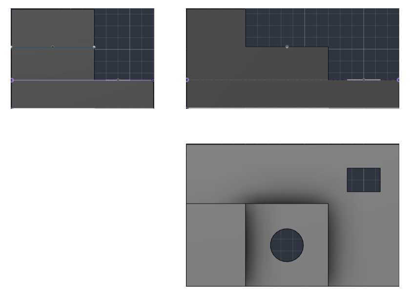
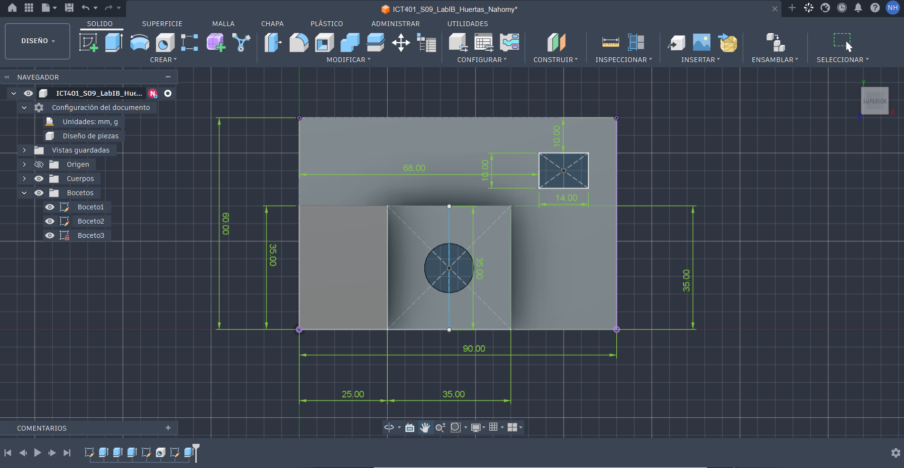
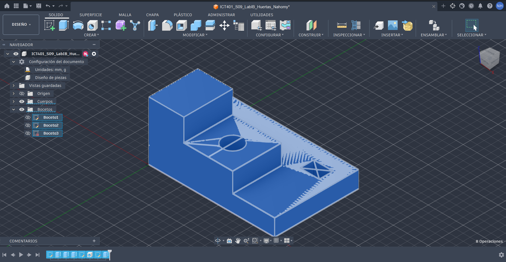
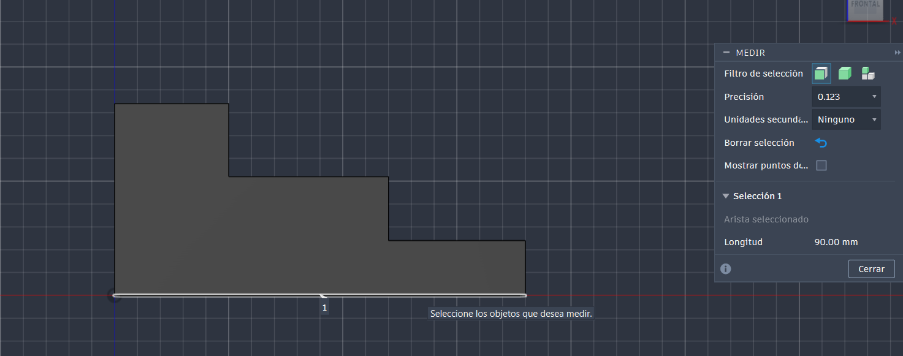

# ICT401 · Semana 9 — Laboratorio integrador I-B

**Reconstrucción 3D a partir de un plano o conjunto de vistas — 10 %**

- Estudiante: Nahomy Marcela Huertas Esquivel
- Grupo: 60
- Fecha: 17/9/2026
- Nombre del archivo de Fusion: `ICT401_S09_LabIB_Huertas_Nahomy`
- Carpeta/proyecto de Fusion Cloud con acceso docente: Nahomy Huertas
- Commit de entrega: ICT401_S09_LabIB_Huertas_Nahomy
- 
## Instrucciones de uso de esta ficha

Complete esta ficha durante el laboratorio. No borre respuestas iniciales aunque luego las corrija. Cuando cambie una decisión, explique qué evidencia del plano o del modelo motivó la modificación.

La ficha debe quedar en `Portafolio/semana09/` con el nombre `S09_Lab_IB_Evidencias_Apellido_Nombre.md`. Las imágenes enlazadas deben estar en la misma carpeta. El archivo nativo permanece en Fusion Cloud con acceso docente.

Esta ficha forma parte de la evidencia evaluable del Laboratorio integrador I-B y está estructurada para facilitar una revisión posterior por la persona docente o mediante ChatGPT. La calificación final corresponde siempre al instrumento oficial del curso.

---

## A. Interpretación inicial del plano

### A1 · Dimensiones generales

- X total: 90mm
- Y total: 60mm
- Z total: 42mm

### A2 · Características geométricas identificadas

| Nº | Característica | Descripción | Vista(s) que la definen | Dimensiones asociadas |
|---|---|---|---|---|
| 1 | Base | Bloque principal sobre el que se sostiene toda la estructura. | Frontal / Derecha| X=90, Y=60, Z=12 |
| 2 | Plataforma intermedia | Parte que se encuentra sobre la base y que tiene una altura intermedia. | Frontal / Superior | X=0-60, Y=25-60, Z=28 |
| 3 | Torre superior | Volumen de mayor altura ubicado en la parte superior izquierda. | Frontal / Derecha / Superior | X=0-25, Y=25-60, Z=42 |
| 4 | Agujero pasante cilíndrico | Perforación circular que se encuentra en la plataforma intermedia. | Superior / Frontal, líneas ocultas | Diámetro 14 mm |
| 5 | Ranura pasante rectangular | Abertura rectangular ubicada en la parte derecha de la base. | Superior / Frontal, líneas ocultas | X=68-82, Y=10-22 |

### A3 · Describa la pieza en una frase técnica antes de abrir Fusion

Pieza prismática escalonada de tres niveles, con una torre en la parte posterior izquierda, un agujero pasante circular en la zona central y una ranura rectangular pasante en el lado derecho.

### A4 · ¿Qué plano de boceto utilizará primero y por qué?

Se utilizará primero el plano frontal porque permite dibujar la forma principal de la pieza y definir los diferentes niveles de altura y sus anchos antes de realizar la extrusión.

### A5 · Estrategia inicial de modelado

1. Dibujar el perfil escalonado completo en el plano frontal.
2. Extruir el perfil a lo largo del eje Y hasta 60 mm.
3. Hacer un corte en la zona frontal para definir la profundidad de la plataforma y la torre.
4. Crear un boceto sobre la plataforma intermedia para realizar el agujero pasante de diámetro 14 mm.
5. Crear un boceto en la parte derecha de la base para realizar la ranura rectangular de 14 x 12 mm.
6. Revisar las medidas finales y comprobar las restricciones del modelo.

---

## B. Desarrollo del modelo

### B1 · Boceto base

- Plano seleccionado: Plano frontal
- Geometría principal: Perfil escalonado exterior cerrado formado por líneas rectas que representan los diferentes niveles de la pieza.
- Restricciones aplicadas: Coincidencia con el origen, restricciones horizontales en los escalones y restricciones verticales en las paredes laterales.
- Dimensiones aplicadas: Ancho total de 90 mm, ancho de torre de 25 mm, ancho del tramo medio de 35 mm, altura total de 42 mm, altura del escalón inferior de 12 mm y diferencia de altura intermedia de 16 mm.
- Estado del boceto: Totalmente definido

### B2 · Operaciones principales realizadas

| Orden | Operación | Propósito geométrico | Parámetro/dimensión principal | Resultado |
|---|---|---|---|---|
| 1 | [Extrusión] | [Generar el volumen principal solido] | [Distancia 60 mm en eje Y] | [Bloque escalonado base] |
| 2 | [Corte por extrusión] | [Ajustar la profundidad frontal de la torre y la plataforma] | [Rectángulo Y de 0 a 25 mm y X de 0 a 60 mm] | [Perfil en L en vista superior] |
| 3 | [Corte por extrusión] | [Crear la perforación pasante cilíndrica] | [Diámetro 14 mm en centro X 42 Y 42] | [Agujero circular pasante] |
| 4 | [Corte por extrusión] | [Crear la abertura rectangular pasante] | [Rectángulo de 14 por 12 mm de X 68 a 82 y Y 10 a 22] | [Ranura rectangular pasante] |
| 5 | [Inspección] | [Verificar las dimensiones globales finales] | [Ancho 90 mm profundidad 60 mm altura 42 mm] | [Geometría validada] |
| 6 | [Asignación de material] | [Definir las propiedades físicas del modelo] | [Material predeterminado del sistema] | [Modelo 3D parametrizado finalizado] |

### B3 · Cambios respecto a la estrategia inicial

| Cambio realizado | Motivo | Vista/dimensión que reveló el problema | Sketch/operación corregida |
|---|---|---|---|
| [Realizar corte de vaciado en zona frontal en lugar de extruir por partes] | [Simplificar la historia de operaciones y reducir bocetos complejos] | [Vista superior XY con cota de Y de 25 a 60] | [Operación 2 corte por extrusión frontal] |
| [Ajustar el punto central del agujero circular mediante cotas de posición absolutas] | [Evitar desplazamientos no deseados si cambia el tamaño de la plataforma] | [Vista superior XY con centro en X 42 Y 42] | [Boceto 3 ubicación del círculo] |
| [Definir la ranura rectangular usando rangos de coordenadas de extremos] | [Garantizar la distancia exacta desde los bordes de la base inferior] | [Vista superior XY con X de 68 a 82 y Y de 10 a 22] | [Boceto 4 perfil de la ranura] |

---

## C. Verificación contra el plano

### C1 · Correspondencia de vistas

| Vista | ¿Coincide? | Evidencia geométrica | Diferencia detectada | Corrección realizada |
|---|---|---|---|---|
| Front | [Sí] | [Perfil escalonado con anchos de 25 mm 35 mm y 30 mm y líneas ocultas del agujero y la ranura] | [Ninguna] | [Ninguna] |
| Top | [Sí] | [Bloque en L con limites en Y de 25 a 60 mm circulo de diametro 14 mm en centro 42 42 y ranura de 14 por 12 mm] | [Ninguna] | [Ninguna] |
| Right | [Sí] | [Perfil lateral con ancho de 60 mm altura de 42 mm y lineas ocultas de los cortes pasantes] | [Ninguna] | [Ninguna] |

### C2 · Comprobación dimensional

| Nº | Dimensión crítica | Valor del plano | Valor medido en Fusion | Elemento seleccionado | ¿Coincide? |
|---|---|---|---|---|---|
| 1 | [Longitud total en X] | [90 mm] | [90 mm] | [Arista inferior frontal paralela al eje X] | [Sí] |
| 2 | [Ancho total en Y] | [60 mm] | [60mm] | [Arista lateral inferior paralela al eje Y] | [Sí] |
| 3 | [Altura total en Z] | [42 mm] | [42mm] | [Arista vertical de la torre paralela al eje Z] | [Sí] |
| 4 | [Diámetro del agujero circular] | [14mm] | [14mm] | [Cara cilíndrica del agujero central] | [Sí] |
| 5 | [Dimensión de la ranura en X e Y] | [14mm x 12mm] | [14mm x 12mm] | [Aristas del contorno rectangular de la ranura] | [Sí] |

### C3 · Editabilidad paramétrica

Si una dimensión principal de la pieza cambiara, indique qué Sketch, dimensión u operación tendría que editar y por qué.

Si alguna dimensión principal de la pieza cambiara, se tendría que modificar el boceto u operación correspondiente. Por ejemplo, si cambia la longitud o la altura, se puede editar el primer boceto y cambiar la cota de 90 mm o 42 mm en el plano frontal. Si cambia la profundidad, se modifica la primera extrusión cambiando el valor de 60 mm. Para cambiar el agujero, se edita el boceto de la plataforma intermedia, donde se puede modificar el diámetro de 14 mm o la posición del centro. En el caso de la ranura, se edita su boceto para cambiar las medidas de 14 x 12 mm o las distancias respecto a los bordes.

---

## D. Evidencias

### D1 · Modelo final

Modelo completo en orientación pictórica, con nombre del diseño y ViewCube visibles.

### D2 · Vistas de verificación

Montaje de Front, Top y Right del modelo, presentado de manera clara para comparar con el plano base.

### D3 · Boceto y restricciones

Captura del boceto más representativo con restricciones y dimensiones visibles.

### D4 · Timeline / historial paramétrico

Captura donde se observen las operaciones principales del historial del modelo.

### D5 · Verificación dimensional

Captura de `Inspect > Measure` con una dimensión crítica y el elemento seleccionado visibles.

---

## E. Checklist de entrega

- [ ] Analicé el plano antes de comenzar el modelado.
- [ ] Registré X, Y y Z totales.
- [ ] Identifiqué las características principales y las vistas que las definen.
- [ ] Registré una estrategia inicial antes de modelar.
- [ ] El modelo final corresponde a Front, Top y Right.
- [ ] Verifiqué al menos cinco dimensiones críticas.
- [ ] Los bocetos principales tienen restricciones y dimensiones coherentes.
- [ ] El historial de operaciones es legible y editable.
- [ ] El nombre del archivo cumple la nomenclatura solicitada.
- [ ] El archivo editable está disponible en Fusion Cloud con acceso docente.
- [ ] Las cinco evidencias se visualizan correctamente en GitHub.
- [ ] Esta ficha está completa.

---

# F. Rúbrica oficial del Laboratorio integrador I-B

> Esta rúbrica reproduce los criterios y valores establecidos en el programa oficial. La persona docente puede anotar el puntaje obtenido y observaciones en las columnas finales.

| Criterio oficial | Valor máximo | Evidencia principal en esta ficha | Puntaje obtenido | Observaciones de evaluación |
|---|---:|---|---:|---|
| Interpretación correcta del plano o conjunto de vistas | 2,0 % | Secciones A1–A5 y C1 | [Evaluador] | [Evaluador] |
| Reconstrucción tridimensional coherente | 2,5 % | Secciones B1–B3, D1 y D2 | [Evaluador] | [Evaluador] |
| Aplicación de restricciones y dimensiones | 1,5 % | B1, D3 y C2 | [Evaluador] | [Evaluador] |
| Precisión geométrica y correspondencia con el plano | 2,0 % | C1, C2, D2 y D5 | [Evaluador] | [Evaluador] |
| Organización, nomenclatura y archivo editable | 1,0 % | Identificación, B2, D4 y checklist | [Evaluador] | [Evaluador] |
| Presentación y cumplimiento del enunciado | 1,0 % | Ficha completa, evidencias y checklist | [Evaluador] | [Evaluador] |
| **Total** | **10,0 %** |  | **[Evaluador]** | **[Evaluador]** |

## G. Resumen para evaluación asistida por ChatGPT

Este bloque debe permitir una revisión rápida sin tener que inferir información faltante.

- ¿El estudiante interpretó correctamente X, Y y Z? [Respuesta]
- ¿Las características listadas corresponden con el plano? [Respuesta]
- ¿La estrategia inicial es coherente? [Respuesta]
- ¿El modelo final coincide con las tres vistas? [Respuesta]
- ¿Las dimensiones críticas coinciden? [Respuesta]
- ¿Los bocetos muestran restricciones y dimensiones adecuadas? [Respuesta]
- ¿El timeline muestra una reconstrucción paramétrica razonable? [Respuesta]
- ¿El archivo y las evidencias cumplen nomenclatura y presentación? [Respuesta]
- Incidencias que el evaluador debería revisar directamente en Fusion: [Respuesta]

## H. Retroalimentación del evaluador

### Fortalezas

[Evaluador]

### Aspectos por corregir

[Evaluador]

### Calificación final

**[Evaluador] / 10,0 %**
