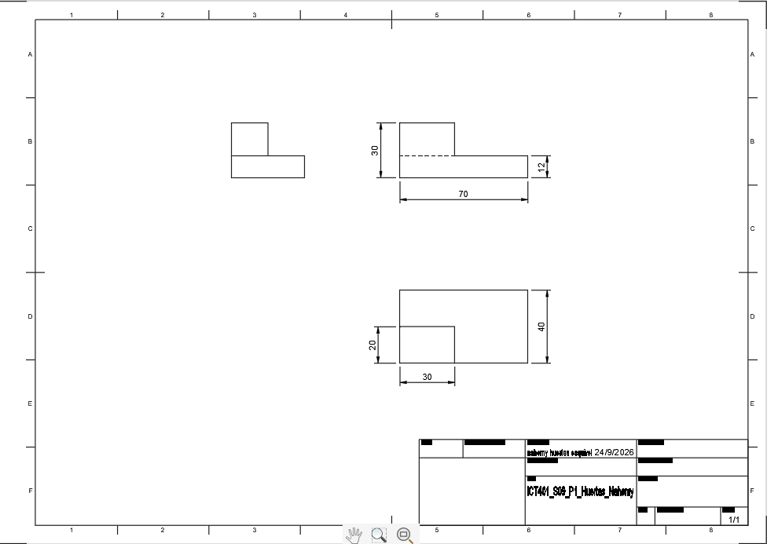
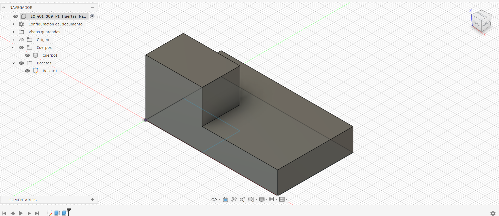
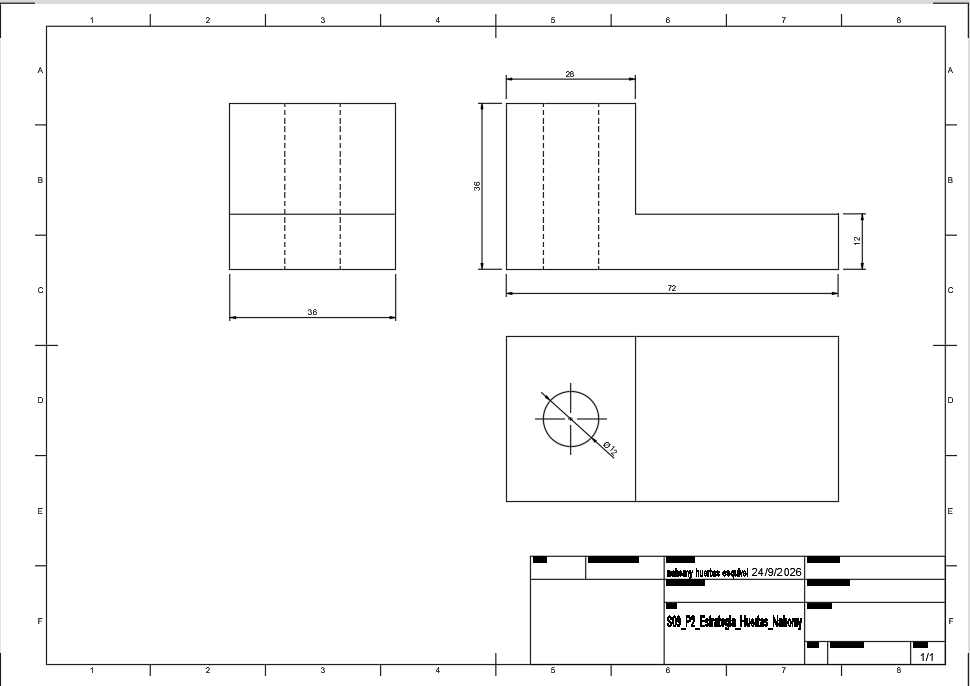
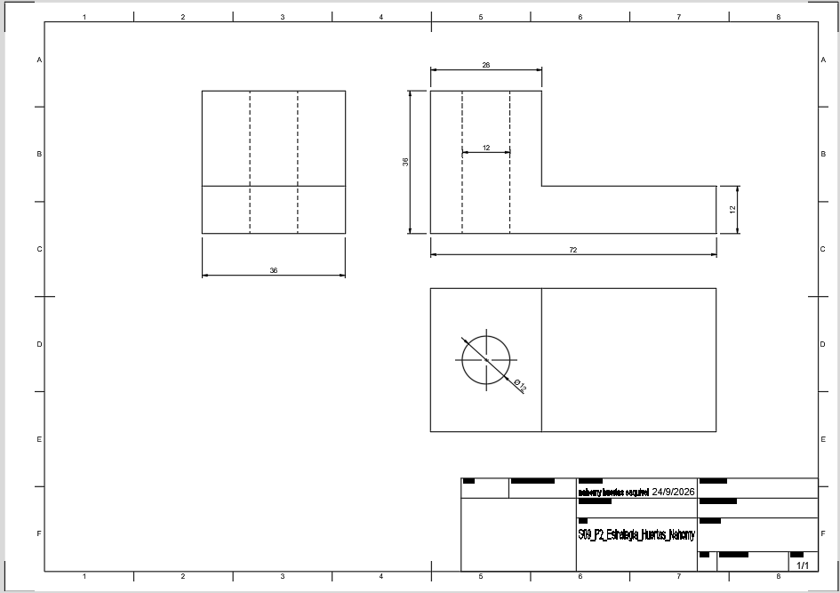
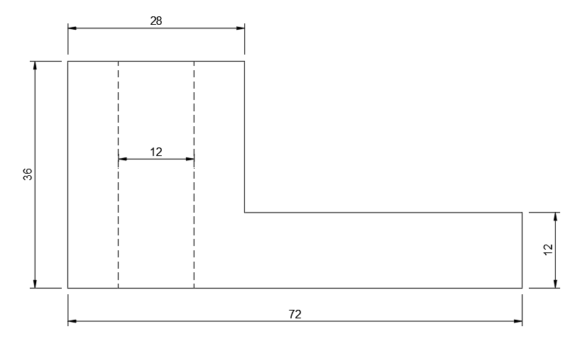
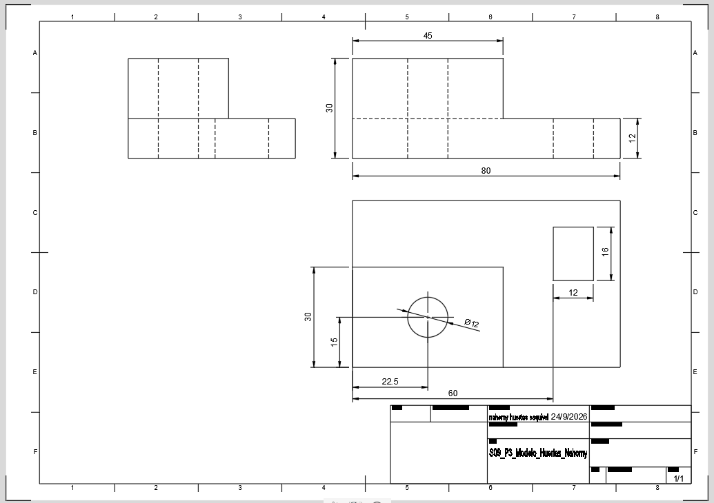
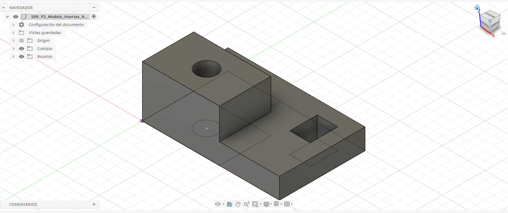

# ICT401 · Semana 10 — Registro de vistas técnicas y acotación normalizada

21 al 26 de septiembre de 2026.

- Estudiante: Nahomy Marcela Huertas Esquivel
- Grupo: 60
- Carpeta o proyecto de Fusion Cloud con acceso docente: Nahomy Huertas
- Modelos utilizados: `ICT401_S10_P1_Apellido_Nombre`, `ICT401_S09_P2_Apellido_Nombre`, `ICT401_S09_P3_Apellido_Nombre` u otros equivalentes.

## Instrucciones

Copie esta plantilla a `Portafolio/semana10/` y guárdela como `S10_Registro_Apellido_Nombre.md`. Sustituya `Apellido_Nombre` por un apellido y un nombre sin espacios ni tildes. Complete cada `[Respuesta]`, agregue las imágenes solicitadas en la misma carpeta y haga commit.

Documente cada decisión de selección de vistas y acotación. Si modifique una decisión durante el proceso, no borre lo anterior: describa qué cambio, qué evidencia del modelo o del Drawing motivó la corrección y qué ajuste realizó.

X = ancho, Y = profundidad, Z = altura. Trabaje en milímetros. Cuando compare vistas, mantenga Front, Top y Right con orientación coherente y cámara ortográfica.

---

## P1 — Del modelo 3D a las vistas técnicas

### P1.1 · Modelo utilizado

- Nombre del diseño en Fusion: ICT401_S10_P1_Huertas_Nahomy
- Pieza de referencia (semana de origen): Semana 9

### P1.2 · Características principales del modelo

| Característica | Descripción | Vista(s) que la comunican |
|---|---|---|
| 1 | Base rectangular alargada | Frontal, Superior y Derecha |
| 2 | Bloque elevado en uno de los extremos | Frontal, Superior y Derecha |
| 3 | Cambio de altura entre la base y el bloque | Frontal y Derecha |
| 4 | Superficie horizontal de menor altura después del bloque | Frontal, Superior y Derecha |

### P1.3 · Vistas seleccionadas y justificación

| Vista | ¿Es necesaria? | ¿Por qué? | ¿Qué información aporta? |
|---|---|---|---|
| Front | si | Permite observar claramente el cambio de altura de la pieza | Muestra el perfil, la altura de la base y la altura del bloque |
| Top | si | Permite observar la forma general y la distribución de las diferentes zonas | Muestra el largo, el ancho y la posición del bloque elevado |
| Right | si | Permite comprobar las alturas y la profundidad de la pieza | Muestra el cambio de altura y la profundidad |
| Otra: [nombre] | [Respuesta] | [Respuesta] | [Respuesta] |

### P1.4 · ¿Algual vista resultó redundante? ¿Cuál y por qué?

No eliminé ninguna de las tres vistas principales porque cada una permite observar una parte diferente de la geometría. La Frontal permite identificar principalmente los cambios de altura, la Superior permite observar la forma y distribución de la pieza, y la Derecha ayuda a comprobar la profundidad y las alturas.

### P1.5 · Método utilizado para generar las vistas en Fusion

Primero revisé el modelo 3D para identificar sus formas principales y los cambios de altura. Después utilicé el entorno Drawing de Fusion para generar la vista Frontal como vista base y proyectar las vistas Superior y Derecha. Finalmente comprobé que las tres vistas correspondieran con la geometría del modelo.

### Evidencias P1

Captura de las vistas ortogonales generadas desde el modelo.

Modelo 3D en orientación isométrica con nombre y ViewCube visibles.

---

## P2 — Creación del plano desde el modelo

### P2.1 · Configuración del Drawing

- Formato seleccionado: A3
- Orientación: Horizontal
- Escala: 2:1
- Justificación de cada elección: Seleccioné el formato A3 porque permite colocar las vistas principales de la pieza y mantener una buena distribución, con una orientación horizontal facilitando organizar las vistas Frontal, Superior y Derecha en escala que sea más visible la figura y sus dimensiones.

### P2.2 · Disposición de vistas

| Vista | Posición en el Drawing | Distancia a la vista adyacente | ¿Alineada correctamente? |
|---|---|---|---|
| Front (base) | Inferior izquierda | N/A (vista base) | Sí |
| Top | Superior (sobre Frontal) | ~30 mm | Sí |
| Right | Derecha (de Frontal) | ~30 mm | Sí |

### P2.3 · ¿Qué problemas de alineación o disposición detectó? ¿Cómo los resolvió?

No detecté problemas importantes de alineación. las vistas quedaron separadas y organizadas de manera que se puede relacionar la información entre ellas y también se dejó suficiente espacio para colocar las cotas sin que se mezclaran con las vistas.

### P2.4 · ¿La escala permite legibilidad de todas las vistas? Justifique.

Sí, la escala 2:1 permite visualizar las tres vistas con claridad y leer las dimensiones sin dificultad. Además, el tamaño de las vistas permite identificar correctamente la forma de la pieza y sus características principales.

### Evidencias P2

Captura del Drawing con las tres vistas insertadas y alineadas.

---

## P3 — Acotación normalizada básica

### P3.1 · Dimensiones generales aplicadas

| Dimensión | Valor | Vista donde se colocó | Justificación |
|---|---|---|---|
| Ancho total (X) | 72mm | Frontal | Indica el largo total de la pieza. |
| Profundidad total (Y) | 36mm  | Superior | Permite apreciar la profundidad completa. |
| Altura total (Z) | 36mm | Frontal | Permite identificar la altura máxima de la pieza. |

### P3.2 · Dimensiones parciales y funcionales

| Característica | Dimensión | Valor | Vista | ¿Repetida en otra vista? |
|---|---|---|---|---|
| Escalón | Largo del escalón | 28 mm | Frontal | No |
| Perforación | Diámetro | 12 mm | Superior | No |
| Perforación | Posición del centro | (14, 18) mm | Superior | No |
| Base | Altura | 12 mm | Frontal | No |

### P3.3 · ¿Eliminó alguna cota por redundante? ¿Cuál?

Sí, se quitaron las cotas que repetían información ya indicada en otra vista, para evitar que el plano tuviera medidas innecesarias.

### P3.4 · ¿Alguna dimensión quedó dentro del contorno de la vista? ¿Qué hizo al respecto?

Sí, cuando alguna cota quedaba dentro del contorno, se desplazó hacia el exterior para que las medidas fueran más fáciles de leer.

### P3.5 · ¿Qué criterio de organización utilizó para disponer las cotas?

Las cotas se organizaron fuera del contorno de la pieza y de forma ordenada, colocando cada dimensión en la vista donde se entiende mejor y evitando repetir medidas.

### Evidencias P3

Captura del Drawing con las cotas aplicadas.

Detalle de una zona del plano donde se aprecie la organización de las cotas.

---

## P4 — Práctica guiada de plano técnico

### P4.1 · Pieza documentada

- Nombre del diseño: ICT401_S10_P3_Huertas_Nahomy
- Pieza de referencia: S09_P3_Modelo_Huertas_Nahomy

### P4.2 · Vistas generadas

| Vista | Información que comunica | Cotas asignadas |
|---|---|---|
| Front | [Elevación principal: ancho total, altura total, escalón y resalte] | [80, 32, 12, 45] |
| Top | [Elevación principal: ancho total, altura total, escalón y resalte.] | [50, 12, 22, 30, 60, 12, 16, 8, 15] |
| Right | [Perfil lateral: contornos y detalles internos,líneas ocultas] | [Ninguna] |

### P4.3 · Resumen de cotas aplicadas

| Tipo de dimensión | Cantidad | Ejemplo |
|---|---|---|
| Generales | [3] | [Ancho 80, Profundidad 50, Altura 32] |
| Parciales | [4] | [Resalte 45, Escalón 12, Ranura 12, 16] |
| Funcionales | [3] | [Diámetro 12, Posición del agujero 22, 30] |
### P4.4 · ¿El plano contiene información suficiente para fabricar la pieza? ¿Falta algo?

El plano contiene las dimensiones principales y las características necesarias para representar la pieza pero para una fabricar completa la pieza podrían faltar algunos detalles como las tolerancias.

### P4.5 · Errores encontrados y correcciones realizadas

| Error detectado | Corrección aplicada | Vista afectada |
|---|---|---|
| [Cotas solapadas/confusas 8 y 15.] | [Reorganizar y mover fuera del dibujo]  | [Superior] |
| [Riesgo de acotar líneas ocultas] | [Mantener cotas solo en vistas con trazo continuo Superior.] | [Derecha] |

### Evidencias P4

Drawing completo con vistas y cotas.

Comparación del Drawing con el modelo 3D.

---

## Reflexión final

La diferencia principal entre documentar una pieza en Semana 9 (reconstrucción desde plano) y documentarla en Semana 10 (generación de vistas desde modelo) es:

En Semana 9 se partió de un plano técnico para interpretar las medidas y reconstruir la pieza en 3D y en semana 10 se partió del modelo 3D para generar las vistas técnicas y organizar la información en el Drawing.

Los criterios que utilicé para seleccionar las vistas necesarias fueron:

Seleccioné las vistas que permitían mostrar las diferentes formas, alturas, profundidades y características de la pieza, también tomé en cuenta que cada vista aportara información diferente y que no fuera innecesaria.

Los principios de acotación normalizada que más influyeron en la claridad de mi plano fueron:

Colocar las cotas de manera ordenada, preferiblemente fuera del contorno, evitar repetir dimensiones y ubicar cada medida en la vista donde se pudiera interpretar con mayor facilidad.

Si tuviera que agregar una vista adicional a una de mis piezas, sería:

Agregaría una vista adicional solamente si alguna característica no quedara completamente definida con las vistas actuales. En ese caso, elegiría la vista que permitiera observar con mayor claridad esa parte de la pieza.

## Checklist

- [ ] Seleccioné las vistas necesarias y justifiqué cada una.
- [ ] Generé las vistas ortogonales correctamente alineadas.
- [ ] Configuré formato, orientación y escala de manera coherente.
- [ ] Apliqué dimensiones generales, parciales y funcionales.
- [ ] Evité cotas repetidas, ambiguas o innecesarias.
- [ ] Organice las cotas fuera del contorno de las vistas.
- [ ] El plano contiene información suficiente para fabricar la pieza.
- [ ] Documenté errores y correcciones sin borrar decisiones iniciales.
- [ ] Las evidencias se visualizan correctamente en GitHub.
- [ ] Los Drawing están disponibles en Fusion Cloud con acceso docente.
- [ ] Completé la reflexión final.

## Cierre del Portafolio Técnico 2

La revisión del portafolio abarca las **semanas 6 a 10**. El plazo para completar y publicar los pendientes de **Semana 10** es el **viernes 25 de septiembre de 2026, a las 11:59 p. m., hora de Costa Rica**. Este plazo no habilita correcciones de las semanas 6 a 9.

Antes del cierre verifique:

- [ ] Las fichas de las semanas 6--10 están completas en `Portafolio/semanaXX/`.
- [ ] Las imágenes y enlaces se visualizan correctamente desde GitHub.
- [ ] Las correcciones están documentadas sin borrar respuestas iniciales.
- [ ] Los modelos están disponibles en Fusion Cloud con acceso docente.
- [ ] Los últimos cambios están publicados en GitHub.

Commit sugerido: `S10 ejercicios Fusion Apellido Nombre`.

Corrección posterior: `S10 correccion Fusion Apellido Nombre`.
