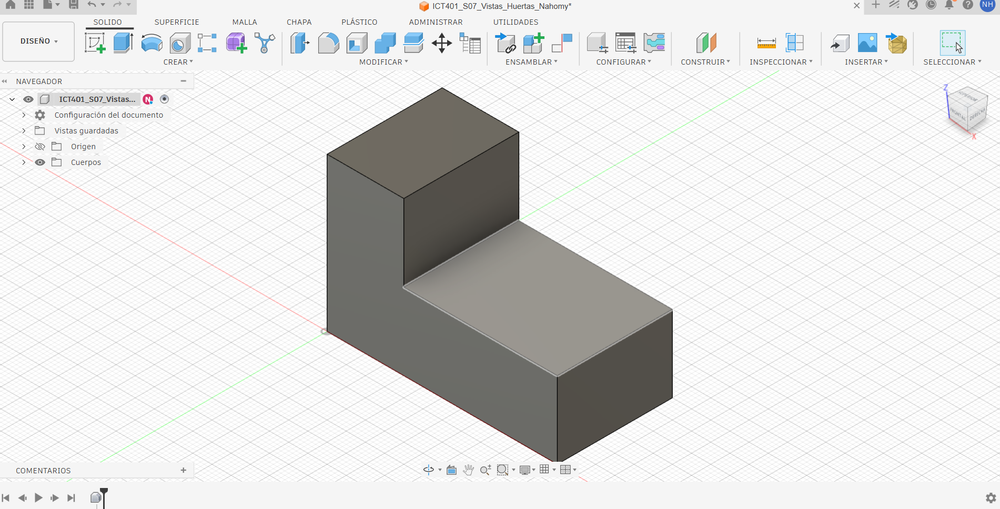
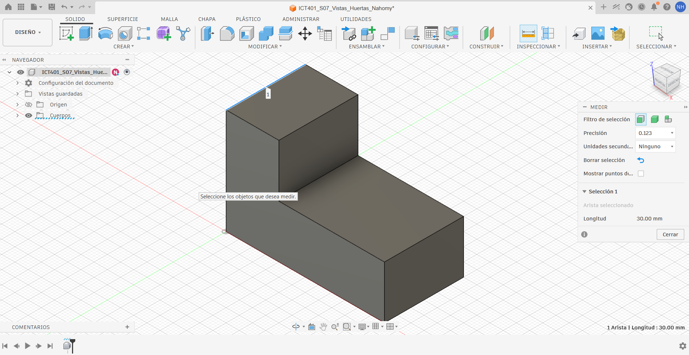
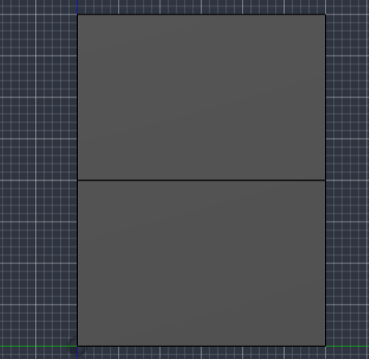
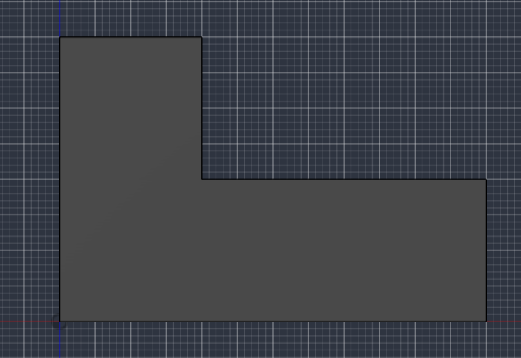
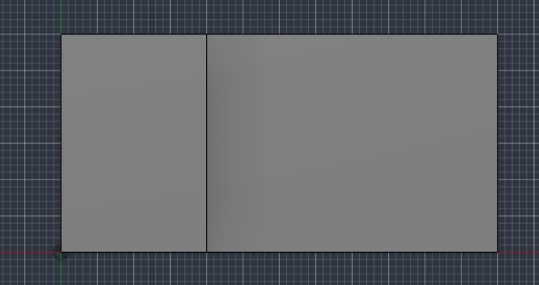

# Semana 7 — Registro de práctica en Fusion

- Estudiante: Nahomy Huertas Esquivel.
- Grupo: 60
- Archivo en Fusion Cloud: `ICT401_S07_Vistas_Huertas_Nahomy`
- Carpeta o proyecto con acceso docente: `Portafolio/Semana 7/
- Sistema para disponer las vistas: primer diedro.
- Cámara de las capturas principales: ortográfica.

Antes de publicar, sustituya `Apellido_Nombre` en todos los nombres y enlaces por sus datos, sin espacios ni tildes. Guarde este archivo como `S07_Registro_Apellido_Nombre.md`, junto a las cinco imágenes en `Portafolio/semana07/`. No agregue un PDF ni fotografías de hojas.

## P1 — Predecir, observar y medir

### Predicción y comprobación

Escriba la predicción antes de seleccionar la vista en Fusion. No borre una predicción incorrecta: explique qué corrigió.

| Vista | Predicción sobre el escalón | ¿Qué observé al seleccionarla? |
|---|---|---|
| Front | [El escalón se verá como silueta, formando una figura en L. Las dimensiones que aparecerán serán la longitud horizontal y la altura vertical.] | [Sí se confirmó. Al seleccionar Frontal, se observa el escalón como parte de la silueta y aparecen las dimensiones horizontal y vertical] |
| Top | [El escalón se verá como una línea interior, porque desde arriba se observa el cambio entre la parte alta y la parte baja. Las dimensiones serán la longitud horizontal y la profundidad.] | [Sí se confirmó. En la vista Superior, el escalón aparece como una línea interior y se observan las dimensiones de largo y profundidad.] |
| Right | [El escalón se verá principalmente como una línea interior horizontal, mostrando el cambio de altura. Las dimensiones serán la profundidad horizontal y la altura vertical.] | [Sí se confirmó. La vista Derecha permite observar la profundidad y la altura, y el cambio de nivel aparece como línea interior.] |

### Medidas verificadas con Inspect > Measure

Seleccione una arista completa y anote su longitud en milímetros. Identifique físicamente la arista, no solo su número o color.

| Dato | Longitud medida (mm) | ¿Qué arista seleccioné? |
|---|---:|---|
| Ancho total | [60mm] | [Arista frontal vertical izquierda] |
| Profundidad | [30mm] | [Arista longitudinal paralera a Y] |
| Altura máxima | [40mm] | [Arista Vertical exterior lado alto] |
| Altura de la parte baja | [20mm] | [Arista vertical exterior lado bajo] |
| Ancho de la parte alta | [20mm] | [Arista superior frontal sector alto] |

### Evidencia del modelo y de una medición

- Vistas que comparten ancho: [Frontal y superior].
- Vistas que comparten altura: [Frontal y derecha].
- Vistas que comparten profundidad: [Superior y derecha].
- Corrección realizada durante la revisión: [No fue necesaria, ya que las predicciones coincidieron con las vistas y medidas obtenidas de Fusion.].

## P2 — Vistas principales obtenidas en Fusion

Las capturas documentan orientación y correspondencia. **Este montaje no es un plano a escala**: el zoom puede variar. Las dimensiones se comprueban con Measure, no midiendo píxeles. No estire las imágenes para forzar proporciones.

| Lateral derecha | Frontal |
|---|---|
|  |  |
| Sin vista en esta posición | **Superior**    |

### Correspondencias comprobadas

| Par de vistas | Dimensión compartida | Valor comprobado en el modelo |
|---|---|---:|
| Frontal y superior | Ancho | 60 mm |
| Frontal y lateral derecha | Altura | 40 mm |
| Superior y lateral derecha | Profundidad | [30 mm |

- La línea interior de la vista superior representa: el cambio de nivel del escalón, como la separación entre la parte alta y la parte baja de la pieza.
- La línea horizontal de la lateral derecha representa: el cambio de altura del escalón, entre la zona de 20 mm de altura y la zona de 40 mm.
- Una esquina del ViewCube no produce una vista principal porque: una esquina combina dos direcciones de observación y las vistas principales se obtienen mediante las caras Frontal, superior y derecha.
- La lateral derecha se sitúa a la izquierda en este registro porque: se está utilizando una proyección donde la vista lateral derecha se coloca a la izquierda de la frontal.
- Corrección realizada después del punto de control: Se corrigió la disposición de las vistas para colocar la lateral derecha a la izquierda de la frontal y la superior debajo de la frontal.

## P3 — Auditoría usando el modelo

Use los casos A, B y C incluidos en la guía. Reutilice las capturas P2 como evidencia; no se piden otras tres imágenes. No modifique la geometría para reproducir los errores.

### Caso A

- Hipótesis inicial: Pensé que el error podía ser que se había escogido una dirección diferente a la vista frontal correcta.
- Acción realizada en Fusion para comprobarla: Seleccioné la vista Frontal en el ViewCube y la comparé con la referencia.
- Error confirmado y corrección justificada: Confirmé que el problema era el cambio de orientación con respecto a la vista frontal de referencia, lo corregí volviendo a seleccionar la vista Frontal, sin modificar la pieza.
- Evidencia: vista frontal de P2.

### Caso B

- Hipótesis inicial: Que el error podía estar en la dirección del ancho entre la vista frontal y la superior.
- Acción realizada en Fusion y dimensión comprobada: Cambié entre las vistas Frontal y Superior y comprobé que el ancho compartido es de 60 mm.
- Error confirmado y corrección justificada: Confirmé que era un error de correspondencia entre las vistas, la corrección es mantener el mismo ancho en ambas vistas según el modelo.
- ¿Por qué este caso a escala común no equivale al zoom distinto de mis capturas?: Porque que las capturas tengan diferente zoom no significa que las medidas sean diferentes, el zoom solo cambia cómo se ve la pieza en la pantalla, mientras que las dimensiones reales siguen siendo las mismas.
- Evidencia: vistas frontal y superior de P2.

### Caso C

- Hipótesis inicial: Pensé que la característica circular que aparecía en el dibujo podía no existir realmente en la pieza.
- Acción realizada en Fusion para comprobarla: Revisé la vista Superior y también hice una órbita para observar mejor la parte superior del sólido.
- Error confirmado y corrección justificada: Confirmé que esa característica circular no existeen el modelo, por eso se debe utilizar la vista superior real de Fusion y no considerar esa línea como parte de la pieza.
- Evidencia: vista superior de P2.

## Verificación de entrega

- [ ] El archivo personal está guardado en Fusion Cloud y accesible para el docente.
- [ ] Completé P1, P2 y P3 con mi trabajo.
- [ ] Las cinco imágenes se ven al abrir este archivo en GitHub.
- [ ] Las vistas principales provienen de cámara ortográfica y caras nombradas.
- [ ] Mi copia conserva el bloque original; no alteré su forma.
- [ ] El commit usa el mensaje `S07 ejercicios Fusion Apellido Nombre`.
- [ ] Esta práctica no sustituye ni duplica la entrega del Laboratorio I-A.

Los retos opcionales se comentan durante la clase; no requieren archivos adicionales.
