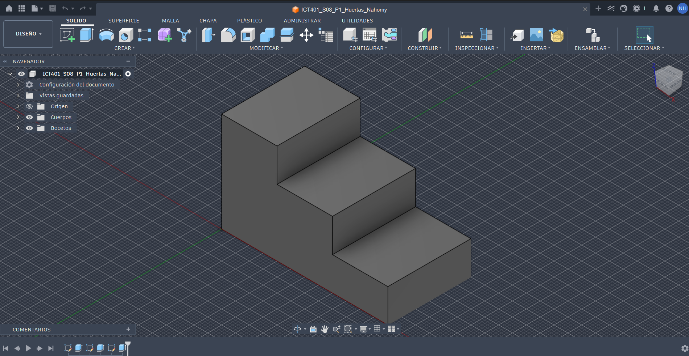
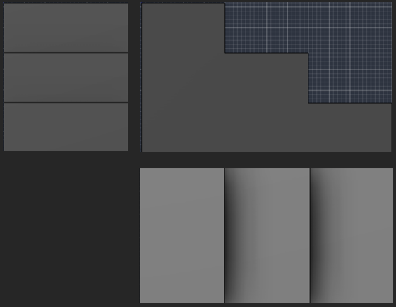
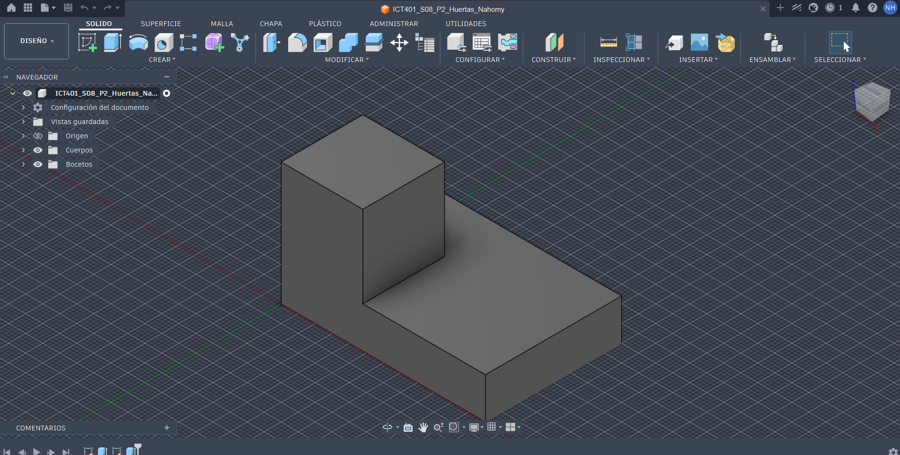
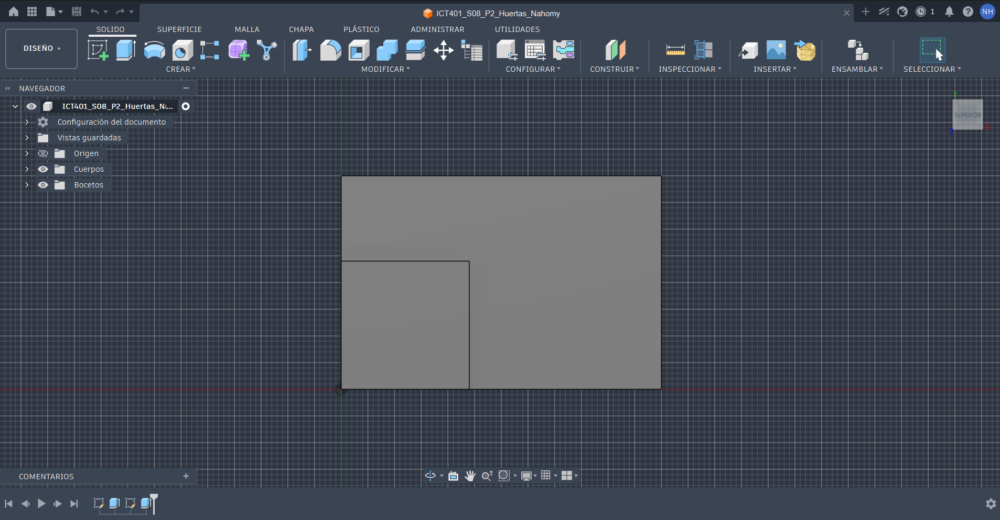

# ICT401 · Semana 8 — Registro formativo de práctica en Fusion

7 al 12 de septiembre de 2026. V Congreso Universitario. Consolidación de contenidos. Sin evaluaciones.

- Estudiante: Nahomy Marcela Huertas Esquivel
- Grupo: 60
- Carpeta o proyecto de Fusion Cloud con acceso docente (sin enlaces privados): Nahomy Huertas
- Modelos proporcionados: `S08_P1_Modelo_Observacion.f3d` y, después de P2, `S08_P2_Modelo_Comprobacion.f3d`.
- Copias personales: `ICT401_S08_P1_Apellido_Nombre` y `ICT401_S08_P2_Apellido_Nombre`.
- Diseños propios: `ICT401_S08_P4_Apellido_Nombre` y `ICT401_S08_P5_Apellido_Nombre`.

## Instrucciones

Copie esta plantilla a `Portafolio/semana08/` y guárdela como `S08_Registro_Apellido_Nombre.md`. Sustituya `Apellido_Nombre` en todos los nombres y enlaces por un apellido y un nombre sin espacios ni tildes. Complete cada [Respuesta], agregue las ocho imágenes en esa misma carpeta y haga commit. No necesita construir otra plantilla.

Escriba las predicciones y decisiones iniciales antes de comprobar. **Nunca borre una respuesta inicial incorrecta:** conserve lo escrito y agregue la corrección y su causa en el apartado posterior. Use la guía para los recursos gráficos y los tiempos de cada P1–P5 (50 minutos cada uno).

X = ancho, Y = profundidad, Z = altura; milímetros. Primer diedro: Right a la izquierda de Front y Top debajo de Front. Cámara ortográfica. Los montajes documentan correspondencia, no son planos a escala: compruebe dimensiones con Measure, no con píxeles. Combine capturas con una herramienta de imágenes o diapositivas y guarde un único PNG por nombre; no deforme imágenes ni oculte el ViewCube. Los recortes temporales no se entregan.

## P1 — Del modelo 3D a las vistas

### P1.1 · Antes de seleccionar Front, Top o Right: ¿qué características, caras y aristas espera ver en cada vista y qué dimensiones aparecerán horizontal y verticalmente?

Frontal: Observar el perfil escalonado de la pieza, con los tres niveles de altura 

Superior: Observar la superficie de arriba de los escalones con un contorno rectangular de la pieza.

Derecha: Observar el perfil lateral de los escalones con los tres niveles de los escalones. 

### P1.2 · ¿Cuál vista considera inicialmente más informativa y por qué?

Para mi la vista Frontal es la más informativa porque permite observar claramente los tres escalones, sus diferentes alturas y la forma general del perfil de la pieza.

### P1.3 · Después de observar Front, Top y Right: ¿qué predicciones confirmó y qué corrigió? Explique por qué sin borrar su respuesta inicial.

Confirmé que la Frontal es la muestra claramente mejor el perfil escalonado y las diferentes alturas. Además que la vista superior permite observar principalmente el ancho y la profundidad de la pieza, en cambio la Derecha muestra la profundidad y la altura. Dependiendo de la orientación de cada vista algunas dimensiones que parecen iguales 

### P1.4 · ¿Qué pares de vistas comparten ancho, altura y profundidad? Anote el valor comprobado en milímetros y la arista seleccionada.

Las vistas Frontal y Superior comparten el ancho, medido con una arista horizontal con una medición de 60,00mm , las vistas Frontal y Derecha comparten la altura, con una arista vertical con una medición de 36,00mm y las vistas Superior y Derecha comparten la profundidad con una arista vertical de 30,00mm.

### P1.5 · Elija una característica tridimensional: ¿cómo aparece en dos vistas diferentes? Identifique las caras o aristas relacionadas.

Una característica tridimensional que se puede identificar es el escalón superior. En la vista Frontal aparece como la parte más alta del perfil, mientras que en la vista Superior se observa como una de las caras superiores de la pieza. Las caras y aristas que delimitan este escalón están relacionadas entre ambas vistas, permitiendo identificar la misma característica desde diferentes orientaciones.

| Vista | Predicción inicial: características y dimensiones | Observación posterior | Corrección y causa |
|---|---|---|---|
| Front | Ver un ancho de 64mm con una altura de 40mm en forma de L |  Se observan los tres niveles de altura en 10mm, 28mm y 40mm | - |
| Top | Ver el ancho y la profundidad desde la parte superior en tres rectángulos| Se visualizan tres recuadros divididos en 20mm y 24mm | La parte frontal inicia desde la parte baja de la figura |
| Right | Ver la profundidad y la altura en tres rectángulos horizontales | Se ven los tres rectángulos simulando los escalones | - |

| Dimensión compartida | Par de vistas | Valor (mm) y arista seleccionada |
|---|---|---|
| Ancho | Frontal y Superior | 60mm, arista horizontal |
| Altura | Frontal y Derecha | 36,00mm, arista vertical |
| Profundidad | Superior y Derecha | 30,00mm, arista vertical |

### Evidencias

Modelo completo en orientación pictórica, ViewCube y nombre de su copia visibles.

Un montaje de tres capturas de Fusion: Right a la izquierda, Front a la derecha y Top debajo de Front; etiquetas y cuerpo completo visibles.

## P2 — De las vistas al modelo mental

### P2.1 · ¿Qué forma general imagina y cuáles son sus cambios de altura?

Imagino como una estructura escalonada con dos niveles sobre una base rectangular. La altura disminuye progresivamente desde el cuadro pequeño dentro del rectángulo, que es la más alta, hasta la forma rectangular, que es la más baja.

### P2.2 · ¿La profundidad se mantiene o cambia entre zonas? Relacione las tres vistas.

La profundidad se cambia en algunas figuras. Las tres vistas permiten comprobar que el ancho y el grosor permanecen iguales, mientras que lo que cambia principalmente es la altura de cada nivel.

### P2.3 · ¿Qué correspondencias encuentra entre vistas?

Las vistas se complementan entre sí. El derecho permite observar claramente las diferentes alturas y el escalón, la superior muestra cómo se distribuyen horizontalmente y la vista frontal permite comprobar el ancho de la pieza.

### P2.4 · ¿Qué información aporta Top y qué información aporta Right?

La vista Superior permite observar la forma de la pieza desde arriba y comprobar la distribución de los escalones. La vista Derecha permite identificar mejor las alturas y Frontal escalonado de la estructura.

### P2.5 · Describa verbalmente la pieza imaginada antes de mirar las alternativas.

Imagino un bloque rectangular formado por dos escalones, con un ancho y una altura que disminuye progresivamente desde la parte de arriba hacia la parte del rectángulo.

### P2.6 · ¿Selecciona A, B, C o D? Justifique antes de comprobar y descarte cada una de las otras tres mediante una vista.

Selecciono el modelo B porque es el que mejor coincide con la forma general de la pieza y con la posición de la parte elevada. Además, mantiene la base rectangular y la distribución de los niveles que se observan en las vistas.

### P2.7 · Después de comprobar: ¿fue correcta su selección, qué interpretó incorrectamente si falló y qué vista fue decisiva? Conserve la selección inicial y explique la corrección.

Sí, mi selección inicial fue correcta. El modelo B coincide con las vistas de referencia. La vista Derecha fue la más importante para comprobar la orientación y la altura de la parte elevada.

| Alternativa | Justificación inicial: seleccionar o descartar | Vista que apoya mi decisión |
|---|---|---|
| A | La descarté porque la parte elevada tiene una distribución diferente a la mostrada en las vistas. | Superior |
| B | La seleccioné porque coincide con la forma, orientación y distribución de la pieza. | Frontal y Derecha |
| C | La descarté porque presenta una distribución diferente de las partes elevadas. | Frontal |
| D |La descarté porque la ubicación de la parte elevada no coincide con las vistas de referencia. | Superior y Derecha |

### Evidencias

Modelo correcto proporcionado por el docente durante la comprobación, en orientación pictórica, con nombre y ViewCube visibles.

## P3 — Detectives de vistas

### P3.1 · Caso A: ¿qué vista parece incorrecta, qué línea produce la inconsistencia, con cuál otra vista entra en contradicción y cómo debería corregirse?

La vista que parece incorrecta es Superior, específicamente la línea horizontal que se extiende más de lo que debería. Esta línea entra en contradicción con la vista Front, ya que no corresponde con la posición de la arista del cambio de altura. Debería corregirse haciendo que la línea termine donde corresponde según la arista mostrada en las otras vistas.

### P3.2 · Caso B: ¿qué dimensión debería conservarse, dónde aparece la contradicción, qué información permite comprobarla y cómo debería corregirse?

La dimensión que debería conservarse es la profundidad Y. La contradicción aparece entre Superior, que muestra una profundidad total de 48 mm, y Derecha que muestra 40 mm. Para comprobarlo, se debe utilizar Measure en Fusion y medir una arista completa en la dirección de profundidad. La corrección sería mantener el mismo valor de profundidad en ambas vistas.

### P3.3 · Caso C: ¿cuál vista no pertenece al conjunto, qué característica lo demuestra, con cuáles vistas entra en contradicción y qué debería mostrar una vista correcta?

La vista que no pertenece al conjunto es Frontal, porque la parte elevada aparece ubicada en el lado contrario al que indican Superior y Derecha. Esto demuestra que la orientación de esa vista no corresponde con las otras dos. Una vista frontal correcta debería mostrar la zona elevada en el mismo lado que se puede deducir mediante las correspondencias de Superior y Derecha.

### P3.4 · Para cada caso: ¿qué acción realizó en Fusion, qué observó y cómo corrigió su hipótesis inicial?

Caso A: En Fusion alterné entre Superior y Frontal y observé la posición de las aristas. Comprobé que la línea horizontal de Superior no correspondía con la geometría del sólido, por lo que corregí mi hipótesis inicial.

Caso B: Utilicé Inspect > Measure para medir la profundidad del sólido. Observé que la misma dimensión debía conservarse entre Superior y Derecha, por lo que confirmé que existía una diferencia entre las vistas y corregí la interpretación.

Caso C: Alterné entre las tres vistas y observé la posición de la parte elevada. Comprobé que Frontal la mostraba en el lado contrario, por lo que determiné que esa era la vista incorrecta.

### P3.5 · ¿Qué caso documentó en la captura y qué detalle demuestra el error?

Documenté el caso A en la captura. El detalle que demuestra el error es que una de las líneas de la vista Superior no coincide con la posición de la arista que se observa en las vistas Frontal y Derecha, generando una contradicción en la forma de la pieza.

| Caso | Hipótesis inicial | Acción en Fusion y observación | Corrección y causa |
|---|---|---|---|
| A | Pensé que la vista Superior tenía una línea incorrecta. | Comparé las vistas Superior, Frontal y Derecha en Fusion y revisé la posición de las aristas. | Confirmé que la línea no correspondía con la geometría del sólido y debía corregirse. |
| B | Pensé que había una diferencia en la profundidad de la pieza. | Utilicé Measure para comprobar la profundidad del modelo. | Confirmé que la profundidad debía ser igual en Superior y Derecha, la diferencia era de 48 mm contra 40 mm. |
| C | Pensé que una de las vistas estaba orientada de forma diferente. | Comparé las tres vistas y observé la ubicación de la parte elevada.| Confirmé que la vista Frontal no correspondía con las otras dos vistas. |

### Evidencias

Una vista de Fusion que compruebe uno de los errores; nombre y ViewCube visibles. Para el caso B, incluya Measure con la arista completa y su longitud.

## P4 — Reconstrucción 3D guiada

### P4.1 · Antes de abrir Fusion: indique ancho total, altura máxima, profundidad total y número de niveles o cambios principales.

El ancho total de la pieza es de 64 mm, la profundidad es de 40 mm y la altura máxima alcanza los 40 mm. La pieza está formada por tres niveles principales, con alturas de 10, 28 y 40 mm.

### P4.2 · ¿Qué vista usará como referencia, qué plano inicial elegirá y cómo será su boceto base? Justifique relacionando las vistas.

Tomaré la vista Frontal (X–Z) como referencia y utilizaré el plano XZ para realizar el primer boceto. El boceto tendrá el perfil escalonado de la pieza, utilizando el ancho de 64 mm y las alturas de 10, 28 y 40 mm. Luego, la vista Superior permitirá completar la información de profundidad.

### P4.3 · ¿Cuál será su primera operación 3D y qué características posteriores prevé? Justifique.

Primero realizaré una extrusión de 40 mm a partir del perfil creado en el boceto frontal, formando el volumen principal. Después agregaré o ajustaré las características necesarias para representar los diferentes niveles y las divisiones que se observan en las vistas Superior y Derecha.

### P4.4 · Después de construir: ¿coincide Front, coincide Top y coincide Right? Para cada vista cite un contorno, una arista y una dimensión comprobada.

Frontal: Coincide, porque se observa el perfil escalonado con sus diferentes niveles de altura. Se comprobó el ancho total de 64 mm y las alturas de 10, 28 y 40 mm.

Superior: Coincide, ya que presenta el contorno rectangular y permite comprobar la distribución de la pieza en profundidad. Se verificó un ancho de 64 mm y una profundidad total de 40 mm.

Derecha: Coincide, porque muestra el perfil lateral y los cambios de altura. Se comprobó una profundidad de 40 mm y una altura máxima de 40 mm.

### P4.5 · ¿Qué fue necesario corregir y qué Sketch, operación o dimensión controlaba la corrección? Si no hubo cambios, justifique con una comprobación.

No fue necesario realizar correcciones, ya que al comparar el modelo con las tres vistas las dimensiones principales coincidieron. La comprobación se realizó revisando las medidas del modelo y relacionando las dimensiones compartidas.

| Vista | ¿Coincide? | Contorno y arista | Dimensión comprobada (mm) | Corrección y causa |
|---|---|---|---|---|
| Front | Sí | Perfil escalonado y aristas horizontales de los niveles | Ancho: 64 / Altura máxima: 40 | No fue necesaria, las alturas coincidieron con 10, 28 y 40 mm. |
| Top | Sí | Contorno rectangular y arista transversal en la zona de cambio | Ancho: 64 / Profundidad: 40 | No fue necesaria, la profundidad coincidió con la referencia. |
| Right | Sí | Perfil lateral y aristas correspondientes a los cambios de nivel | Profundidad: 40 / Altura: 40 | No fue necesaria, las dimensiones coincidieron con el modelo. |

### Evidencias

Modelo terminado completo en orientación pictórica, nombre del diseño y ViewCube visibles.

Montaje con tres pares: vista de referencia de esta guía junto a su correspondiente vista de Fusion. Disponga Right a la izquierda, Front a la derecha y Top debajo de Front.

## P5 — Reto de reconstrucción autónoma

### P5.1 · Antes de modelar: indique ancho total, altura máxima y profundidad total.

El ancho total es de 72 mm, la altura máxima es de 40 mm y la profundidad total es de 48 mm.

### P5.2 · ¿Qué vista elegirá para comenzar, qué plano inicial y qué primera operación prevé? Justifique.

Se elegirá la vista Frontal (X–Z) en el plano frontal para realizar el perfil escalonado, con alturas de 12, 24 y 40 mm, y posteriormente extruirlo a 48 mm de profundidad. Esta vista permite definir la forma principal de la pieza y después completar los cortes utilizando las vistas Superior y Derecha.

### P5.3 · ¿Qué características posteriores prevé, cuál es la más difícil de interpretar y qué vistas necesita relacionar para comprenderla?

Se prevén dos cortes por extrusión para remover material en los bloques frontales, uno hasta Y=18 mm en X=24 y otro hasta Y=30 mm en X=48.

La característica más difícil de interpretar son los cortes escalonados en profundidad, porque no tienen la misma profundidad. Para comprenderlos es necesario relacionar las vistas Superior (X–Y) y Derecha (Y–Z), asociando las profundidades con sus respectivas alturas.

### P5.4 · Después de construir: ¿coinciden Front, Top y Right? Para cada vista cite un contorno, una arista y una dimensión comprobada.

Frontal: Sí coincide. Se observa el contorno exterior escalonado, la arista horizontal correspondiente al nivel de 24 mm y se comprueba el ancho total de 72 mm.

Superior: Sí coincide. Se observa el contorno exterior de 72 × 48 mm, la arista correspondiente al cambio en X=24 y se comprueba la profundidad indicada de 48 mm.

Derecha: Sí coincide. Se observa el contorno lateral escalonado, la arista horizontal correspondiente al nivel inferior de 12 mm y se comprueba la profundidad total de 48 mm.

### P5.5 · ¿Funcionó la estrategia inicial, qué tuvo que modificar, qué vista permitió detectarlo y qué haría diferente si reconstruyera nuevamente la pieza?

La estrategia inicial funcionó y no fue necesario realizar modificaciones, ya que las dimensiones obtenidas coincidieron con las del plano. La vista Superior permitió comprobar principalmente la profundidad y la ubicación de los cortes. Si tuviera que reconstruir nuevamente la pieza, analizaría primero todas las vistas para determinar si es posible reducir la cantidad de operaciones sin perder precisión.

| Vista | ¿Coincide? | Contorno y arista | Dimensión comprobada (mm) | Corrección y causa |
|---|---|---|---|---|
| Front | Sí | Contorno escalonado y arista a 24 mm | Ancho: 72 | Ninguna, medida correcta en el boceto inicial |
| Top | Sí | Contorno exterior y arista correspondiente al cambio en X=24 | Profundidad: 48 | Ninguna, validada después de las operaciones |
| Right | Sí | Contorno lateral escalonado y arista a 12 mm | Profundidad: 48 | Ninguna, generada correctamente por proyección |

### Evidencias

Modelo terminado completo en orientación pictórica, nombre del diseño y ViewCube visibles.

Montaje con tres pares: vista de referencia de esta guía junto a su correspondiente vista de Fusion. Disponga Right a la izquierda, Front a la derecha y Top debajo de Front.

## Reflexión final

Una vista por sí sola puede ser insuficiente porque:

Oculta una de las dimensiones de la pieza y no permite comprender completamente la profundidad, altura o ubicación de algunos cortes y cambios de nivel.

Para relacionar correctamente varias vistas debo comprobar:

La alineación de los ejes X, Y y Z, además de comprobar que las aristas, cambios de nivel y dimensiones correspondan entre las diferentes vistas.

Antes de comenzar una reconstrucción 3D conviene:

Analizar las dimensiones generales, identificar la vista que muestra mejor la forma principal y establecer una secuencia de bocetos, extrusiones y cortes antes de comenzar a modelar.

La diferencia principal entre lo que hice en Semana 7 y Semana 8 es:

En Semana 7 me enfoqué principalmente en identificar errores y validar geometrías más simples, mientras que en Semana 8 realicé una reconstrucción autónoma de una pieza con cambios de nivel y profundidad.

Lo que todavía necesito practicar antes de reconstruir una pieza a partir de un plano es:

La interpretación de cortes con diferentes profundidades y la organización de las operaciones para realizar el modelo de una manera más sencilla y ordenada.

## Checklist

- [ ] Completé P1 antes y después de observar las vistas.
- [ ] Justifiqué mi selección en P2.
- [ ] Identifiqué y comprobé inconsistencias en P3.
- [ ] Planifiqué P4 antes de comenzar a modelar.
- [ ] Comprobé P4 contra las tres vistas originales.
- [ ] Realicé P5 con mayor autonomía.
- [ ] Comprobé P5 contra las vistas originales.
- [ ] Respondí las preguntas de reflexión.
- [ ] Las ocho imágenes se visualizan correctamente en GitHub.
- [ ] Mis modelos P4 y P5 están disponibles para revisión docente en Fusion Cloud.
- [ ] Conservé mis predicciones iniciales aunque fueran incorrectas.
- [ ] Expliqué las correcciones realizadas.
- [ ] El commit utiliza el mensaje solicitado.

Commit: `S08 ejercicios Fusion Apellido Nombre`.

Corrección posterior: `S08 correccion Fusion Apellido Nombre`.

Abra el registro en GitHub y compruebe los ocho enlaces. Los archivos nativos permanecen en Fusion Cloud con acceso docente. Este registro conserva práctica formativa y no constituye una entrega evaluada de portafolio.
