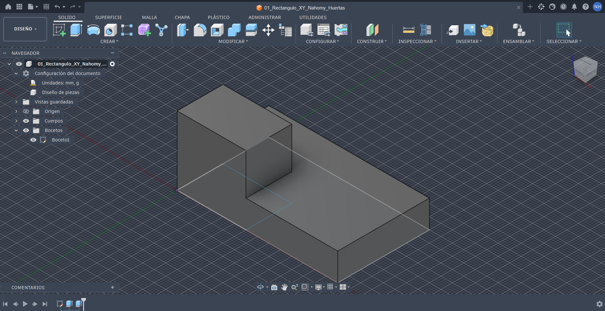
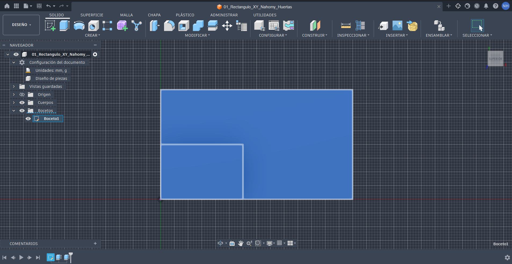

# ICT401 · Semana 9 — Registro de interpretación y reconstrucción 3D

14 al 19 de septiembre de 2026.

- Estudiante: Nahomy Marcela Huertas Esquivel
- Grupo: 60
- Carpeta o proyecto de Fusion Cloud con acceso docente: [Respuesta]
- Copias personales: `ICT401_S09_P1_Apellido_Nombre`, `ICT401_S09_P2_Apellido_Nombre`, `ICT401_S09_P3_Apellido_Nombre`.

## Instrucciones

Copie esta plantilla a `Portafolio/semana09/` y guárdela como `S09_Registro_Apellido_Nombre.md`. Sustituya `Apellido_Nombre` por un apellido y un nombre sin espacios ni tildes. Complete cada `[Respuesta]`, agregue las imágenes solicitadas en la misma carpeta y haga commit.

Conserve siempre la estrategia inicial. Si modifica una decisión durante el modelado, no borre lo anterior: describa qué cambió, qué evidencia del plano o del modelo motivó la corrección y qué elemento paramétrico modificó.

X = ancho, Y = profundidad, Z = altura. Trabaje en milímetros. Cuando compare vistas, mantenga Front, Top y Right con orientación coherente y cámara ortográfica.

---

## P1 — Del plano a la estrategia de modelado

### P1.1 · Dimensiones generales identificadas antes de abrir Fusion

- X total: 70mm
- Y total: 40mm
- Z total: 40mm

### P1.2 · Características geométricas identificadas

| Característica | Descripción | Vista(s) que la definen | Dimensiones asociadas |
|---|---|---|---|
| 1 | Base rectangular | Frontal, Superior y Derecha | 70 × 40 × 20 mm |
| 2 | Resalte posterior izquierdo | Frontal, Superior y Derecha | 30 × 20 × 40 mm |
| 3 | Posición del resalte | Superior y Frontal | Ubicado en la parte posterior izquierda |
| 4 | Altura final de la pieza | Derecha y Frontal | 40 mm |

### P1.3 · ¿Qué plano de boceto utilizará primero y por qué?

Utilizaré el plano XY (TSuperior) porque permite definir el ancho y la profundidad de la pieza, además de ubicar correctamente el resalte.

### P1.4 · Estrategia inicial de modelado

1. Crear un boceto en el plano XY tomando como referencia la vista Superior.
2. Dibujar la base con sus dimensiones de 70 × 40 mm.
3. Definir en el mismo boceto la posición y dimensiones del resalte.
4. Extruir la base y luego crear el resalte hasta alcanzar las alturas indicadas.
5. Comprobar el modelo comparando las vistas Frontal, Superior y Derecha
   
### P1.5 · Después de comprobar en Fusion, ¿qué parte de la estrategia funcionó y qué tuvo que corregir?

La estrategia de comenzar con la vista superior funcionó para definir correctamente el ancho, la profundidad y la posición del resalte. Tuve que corregir la altura del resalte al comparar el modelo con las vistas del plano.

### P1.6 · ¿Qué vista o dimensión permitió detectar la corrección?

La vista Front permitió detectar la corrección, ya que al compararla con el modelo se pudo verificar la altura total de 40 mm y la altura del resalte. Esto permitió identificar que era necesario ajustar la altura para que coincidiera correctamente con las dimensiones indicadas en el plano.

### Evidencias P1

Modelo parcial o final en orientación pictórica, con nombre del diseño y ViewCube visibles.

Captura donde se vea el Sketch, dimensión u operación que mejor representa la estrategia seguida.

---

## P2 — Dos estrategias para una misma pieza

### P2.1 · Resuma la estrategia A

Consiste en construir en el plano XZ el perfil frontal completo en L, con 72 mm de ancho, 36 mm de altura total y una base de 28 mm de altura, extruirlo 36 mm de profundidad y posteriormente crear la perforación vertical pasante de 12 mm, ubicada según el centro indicado en Superior.

### P2.2 · Resuma la estrategia B

Consiste en construir primero la base desde un boceto en el plano XY, con 72 mm de ancho y 36 mm de profundidad, y extruirla hasta la altura de 28 mm. Luego se crea la torre izquierda mediante un segundo boceto y una segunda extrusión Join hasta alcanzar la altura total de 36 mm. Finalmente, se realiza la perforación vertical pasante de 12 mm, cuyo centro está indicado en Superior como 14, 18.

### P2.3 · ¿Ambas estrategias pueden producir la misma geometría? Justifique.

Sí, ambas estrategias pueden producir la misma geometría final de 72 × 36 × 36 mm, con una base de 28 mm de altura y una perforación pasante de 12 mm ubicada en el centro 14, 18. La diferencia está en la forma de construirla: la estrategia A parte del perfil frontal completo, mientras que la estrategia B construye primero la base, después la torre y finalmente la perforación.

### P2.4 · Compare las estrategias

| Criterio | Estrategia A | Estrategia B | ¿Cuál considera mejor y por qué? |
|---|---|---|---|
| Número de operaciones | 2 bocetos y 2 extrusiones: una de unión para el perfil de 72 × 36 mm, extruido 36 mm, y una de corte para el agujero 12 mm. | 1 boceto para la base de 72 × 36 mm y 2 extrusiones de unión a distinta altura: base de 28 mm y torre hasta 36 mm de altura total, más el corte del agujero 12 mm. | Estrategia A, porque requiere menos operaciones para construir la pieza. |
| Claridad de intención de diseño | Separa la forma general del cuerpo escalonado de 72 × 36 × 36 mm y la función del agujero pasante 12 mm. | Construye por separado la base de 28 mm y la torre hasta 36 mm, además de la perforación 12 mm. | Estrategia A, porque refleja de forma más directa el perfil general de la pieza y mantiene el agujero como una característica independiente. |
| Facilidad de edición | Modificar la posición del agujero (14,18) o su diámetro 12 mm no altera el perfil en L inicial. | Permite modificar por separado la base y la torre, aunque algunos cambios pueden afectar las operaciones posteriores. | Estrategia A, porque el agujero se puede modificar independientemente del perfil principal. |
| Dependencia entre operaciones | Alta, el agujero depende de la cara superior generada por la primera extrusión de 36 mm. | La torre depende de la base, pero se construye mediante un segundo boceto y una segunda extrusión Join. | Estrategia B, porque permite separar las características de la pieza en operaciones sucesivas. |
| Correspondencia con el plano | Refleja directamente la vista Frontal, con 72 mm de ancho, 36 mm de altura total y 28 mm de altura de base, y añade el detalle del agujero 12 mm definido en Superior. | Utiliza la vista Superior para construir la base de 72 × 36 mm y luego la torre, verificando las alturas de 28 y 36 mm con las otras vistas. | Estrategia A, porque es más intuitiva al dibujar directamente el perfil en L que se observa en la vista frontal. |

### P2.5 · Si cambia una dimensión principal de la pieza, ¿qué estrategia sería más fácil de modificar? Explique qué Sketch u operación tendría que editar.

La Estrategia A sería más sencilla de modificar, ya que el perfil principal y la perforación están separados. Si cambia una medida de la pieza, se puede ajustar el Sketch 1, donde se encuentra el perfil en L, o modificar la Extrusión 1. De esta manera, el Sketch 2 correspondiente al agujero puede mantenerse sin modificaciones si su posición y diámetro no cambian.

### P2.6 · ¿Cuál estrategia usaría finalmente y por qué?

Finalmente utilizaría la Estrategia A, porque permite construir primero la forma principal de la pieza y después agregar la perforación como una característica independiente. Considero que esta forma de modelar facilita la organización del diseño y permite realizar cambios de manera más sencilla sin afectar innecesariamente otras partes del modelo.

### Evidencias P2

Captura del historial/timeline y del modelo obtenido con la estrategia seleccionada.

---

## P3 — Plano → modelo → plano

### P3.1 · Antes de modelar, describa la pieza en una frase técnica

Es un bloque prismático rectangular de 80 × 50 × 30 mm, con un resalte posterior de 45 × 30 mm, una perforación cilíndrica pasante y una ranura rectangular pasante.

### P3.2 · Dimensiones y características clave

| Elemento | Valor o descripción | Vista(s) de donde se obtiene |
|---|---|---|
| X total | 80mm | Frontal y Superior |
| Y total | 50mm | Derecha y Superior |
| Z total | 30mm | Frontal y Derecha |
| Característica 1 | Resalte posterior de 45 × 30 mm | Frontal y Superior |
| Característica 2 | Perforación cilíndrica pasante 12 mm, centro 22,35 | Frontal, Superior y Derecha |
| Característica 3 | Ranura rectangular pasante de 12 × 16 mm, entre X=60–72 y Y=8–24 | Superior y Frontal |

### P3.3 · Estrategia inicial

1. Crear un boceto en el plano XY para establecer el rectángulo principal de 80 × 50 mm y ubicar el resalte posterior de 45 × 30 mm.
2. Extruir la base hasta la altura correspondiente y generar el resalte hasta alcanzar la altura total de 30 mm.
3. Crear un segundo boceto sobre la cara superior y colocar la perforación de 12 mm en el centro indicado 22,35
4. Crear otro boceto sobre la cara superior de la base para realizar la ranura de 12 × 16 mm, ubicada entre X=60–72 y Y=8–24
5. Aplicar las operaciones de corte pasante para la perforación y la ranura, y comprobar las dimensiones finales mediante Inspect > Measure.

### P3.4 · Verificación de vistas

| Vista | ¿Coincide con el plano? | Contorno/característica comprobada | Corrección realizada |
|---|---|---|---|
| Front | Sí | Se comprobó el ancho total de 80 mm, el resalte de 45 mm y las líneas correspondientes a los cortes pasantes | Ninguna, las dimensiones principales coincidieron con el plano. |
| Top | Sí | Se verificó el contorno de 80 × 50 mm, el resalte, la perforación 12 mm en 22,35 y la ranura de 12 × 16 mm. | Se ajustó la posición de la ranura para que coincidiera con X=60–72 y Y=8–24. |
| Right | Sí | [Respuesta] | [Respuesta] |

### P3.5 · Verificación dimensional

| Dimensión crítica | Valor del plano | Valor medido en Fusion | Elemento medido | ¿Coincide? |
|---|---|---|---|---|
| 1 | [Respuesta] | [Respuesta] | [Respuesta] | [Respuesta] |
| 2 | [Respuesta] | [Respuesta] | [Respuesta] | [Respuesta] |
| 3 | [Respuesta] | [Respuesta] | [Respuesta] | [Respuesta] |
| 4 | [Respuesta] | [Respuesta] | [Respuesta] | [Respuesta] |

### P3.6 · ¿Qué cambió entre su estrategia inicial y el modelo final?

[Respuesta]

### P3.7 · Si tuviera que cambiar una dimensión principal, ¿qué Sketch, dimensión u operación editaría?

[Respuesta]

### Evidencias P3

Modelo final en orientación pictórica, con nombre y ViewCube visibles.

Montaje de Front, Top y Right del modelo para compararlos con el plano.

Captura de una comprobación dimensional con `Inspect > Measure`.

---

## Reflexión final

La diferencia principal entre reconstruir una pieza en Semana 8 y reconstruirla desde un plano en Semana 9 es:

[Respuesta]

Antes de abrir Fusion, la información mínima que debo extraer de un plano es:

[Respuesta]

Una estrategia de modelado es mejor que otra cuando:

[Respuesta]

La comprobación final más importante para asegurar que el modelo corresponde al plano es:

[Respuesta]

## Checklist

- [ ] Registré la estrategia inicial de P1 antes de comprobar en Fusion.
- [ ] Comparé dos estrategias en P2 y justifiqué mi selección.
- [ ] Reconstruí P3 a partir del plano sin usar un modelo 3D de referencia.
- [ ] Comparé Front, Top y Right contra el plano.
- [ ] Verifiqué al menos cuatro dimensiones críticas en P3.
- [ ] Documenté las correcciones sin borrar mis decisiones iniciales.
- [ ] Las cinco imágenes se visualizan correctamente en GitHub.
- [ ] Los modelos P1–P3 están disponibles en Fusion Cloud con acceso docente.
- [ ] Completé la reflexión final.

Commit sugerido: `S09 ejercicios Fusion Apellido Nombre`.

Corrección posterior: `S09 correccion Fusion Apellido Nombre`.
