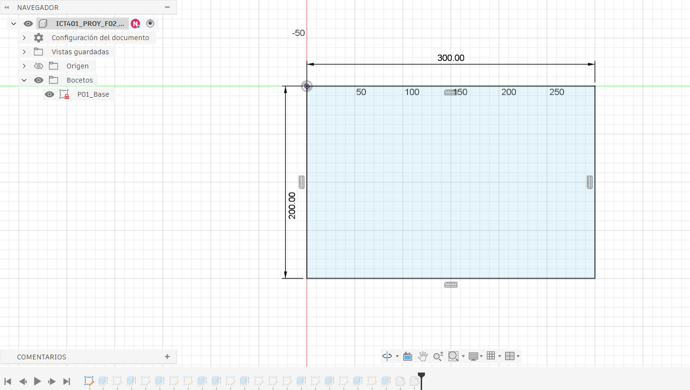
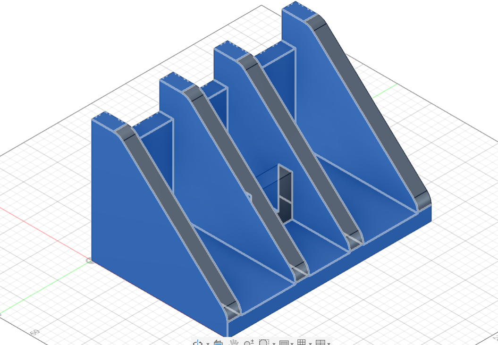
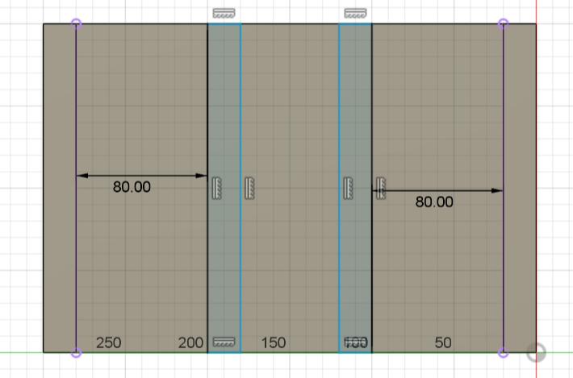
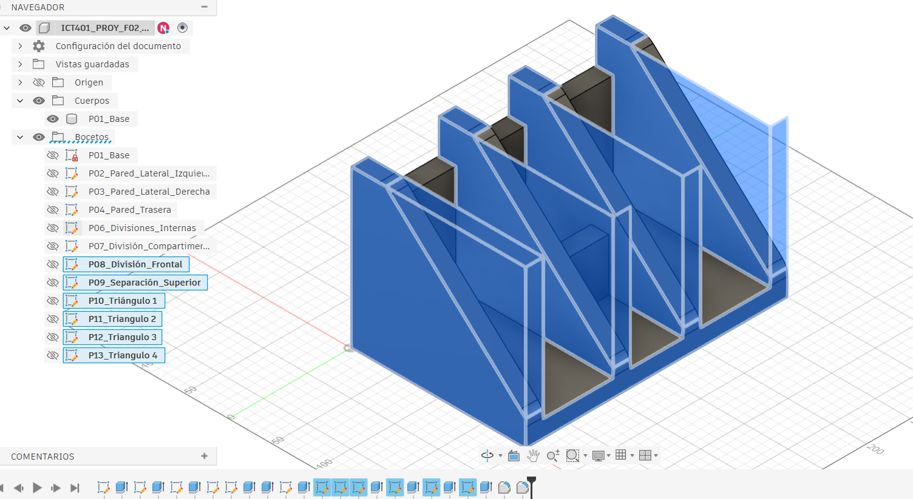
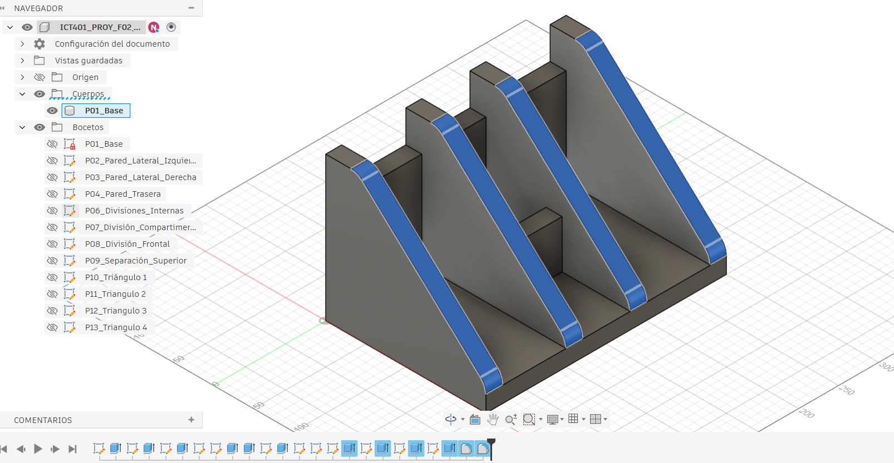
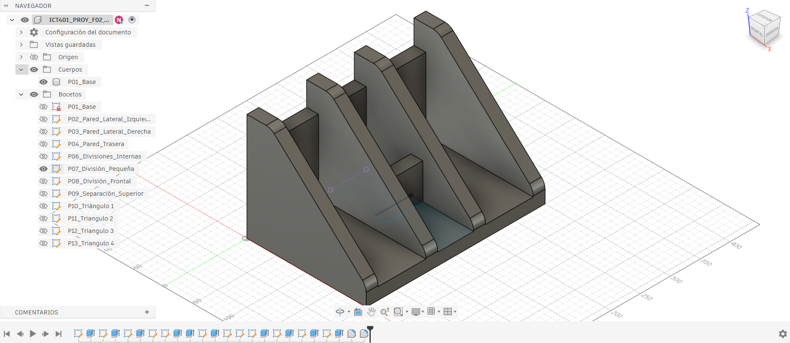

# Fase 2: Modelado 3D en Autodesk Fusion 360

---

## 1. Información general

| Campo | Información |
|---|---|
| Proyecto | Modelado 3D |
| Fase | 2 |
| Software | Autodesk Fusion |
| Estudiante | Nahomy Marcela Huertas Esquivel |
| Curso | Dibujo Técnico Asistido por Computadoras |
| Fecha de entrega | 8/10/2026 |

## 2. Descripción del proyecto

En esta fase se desarrolla un modelo tridimensional utilizando Autodesk Fusion, siguiendo el croquis y las indicaciones de la actividad. El proceso incluye la construcción de la base, creación de las cinco paredes, definición de dimensiones y realización de los cortes diagonales correspondientes. En el proceso se hicieron variaciones en diferentes medidas para tener una mejor dimensión del modelo.

## 3. Objetivos

- Construir el modelo tridimensional en Autodesk Fusion.
- Aplicar dimensiones establecidas en el croquis (con variaciones).
- Modelar la base y las cinco paredes.
- Realizar los cortes diagonales indicados en el diseño.
- Registrar el procedimiento mediante evidencias.

## 4. Herramientas utilizadas

- **Autodesk Fusion:** diseño y modelado tridimensional.
- **GitHub:** almacenamiento y documentación del proyecto.
- **Capturas de pantalla:** evidencias del proceso de modelado.

## 5. Dimensiones del modelo
Algunos espacios se le modificaron mediciones a como mencionaba el croquis a conveniencia de un mejor espacio proporcionado.

| Elemento | Dimensión | 
|---|---|
| Base | 300mm x 200mm | 
| Cuatro paredes | 160mm de altura x 20mm de grosor | 
| Pared Trasera |  120mm de altura x 20mm de grosor | 
| Divisiones Internas | 80 mm (Entre paredes IZQ y DER) y espacio en medio 60mm| 
| Cortes diagonales | 202,744mm | 
| División compartimento | 75mm distancia entre pared trasera x 20mm grosor | 

## 6. Procedimiento de modelado

En el archivo se mencionan 07 bocetos finales del modelos, sin embargo a la hora de su creación en Fusion fue necesario crear más de estos dando como resultado final 13 bocetos.

### 6.1. Preparación del diseño

Se prepara el diseño en Autodesk Fusion 

**Evidencia 1. Preparación del diseño**

### 6.2. Construcción de la base y las paredes

Se construye la base y se incorporan las cinco paredes de la pieza.

**Evidencia 2. Base y cuatro paredes**

### 6.3. Definición de las dimensiones

Se ajustan las cotas del modelo y se establece la medida de 80 mm para la dimensión que se estaba modificando.

**Evidencia 3. Cotas del modelo**

### 6.4. Cortes diagonales

Se definen los perfiles necesarios para realizar los cortes diagonales en las paredes, de acuerdo con el croquis de referencia.

**Evidencia 4. Boceto de los cortes**

**Evidencia 5. Resultado de los cortes + chafan en esquinas**

### 6.5. Modelo final

**Evidencia 6. Modelo final**

## 7. Dificultades encontradas

Durante el proceso surgieron dudas sobre la definición de las cotas y la realización de los cortes diagonales en las cuatro paredes.

| Dificultad | Acción |
|---|---|
| Definición de las cotas | Ajustar las medidas según el croquis aunque igual se modificaron varias cosas a como decía el croquis por mejor distribución. |
| Cortes diagonales | Crear los perfiles de corte uno por uno y aplicar la operación correspondiente. |
| Documentación | Registrar cada etapa mediante capturas de pantalla. |

└── archivos/
    └── modelo-fase-2.f3d
